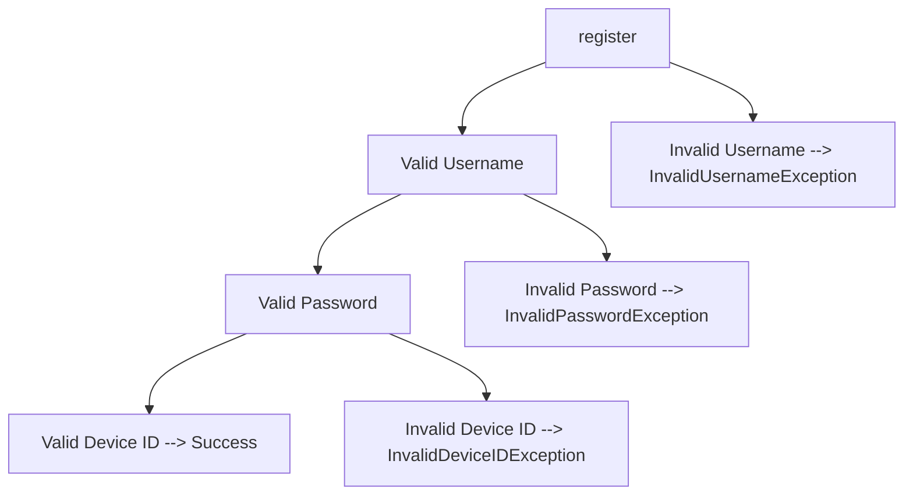

## Test Template Tree
### Register

```mermaid
graph TD;
    A[register] --> B[Valid Username];
    A --> C[Invalid Username --> InvalidUsernameException];
    B --> D[Valid Password];
    B --> E[Invalid Password --> InvalidPasswordException];
    D --> F[Valid Device ID --> Success];
    D --> G[Invalid Device ID --> InvalidDeviceIDException];
```